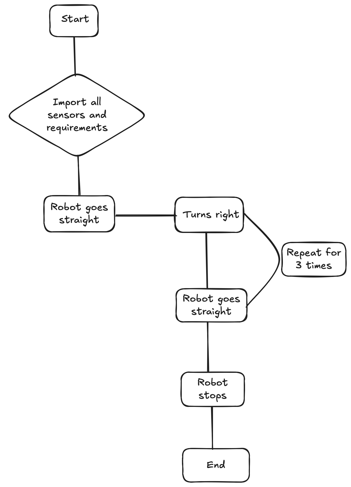
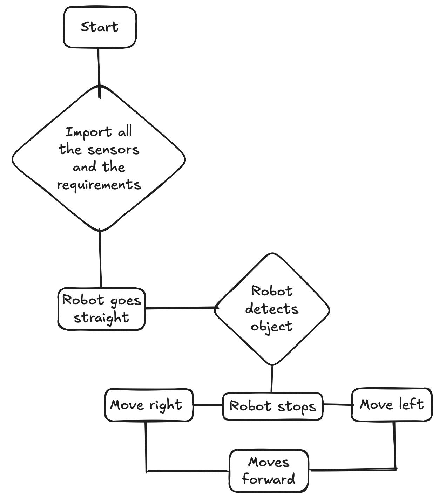

# Year9 Computing Technology Project Portfolio
## By William, Karna, Quintus and Ashwin

# Identifying the Need
The heart of this course lies in the hands-on application of programming to solve real-world problems. We’ll start
this by using the Lego EV3 robotics platform and MicroPython. In this project, you will work in teams to design,
program, and test a Lego EV3 robot to solve a specific problem or address a particular need.

### Requirements Definition - List of non-functional and functional requirements that your robot must meet to address the problem effectively

#### Functional Requirements of the robot
- Code execution: robot must perform actions and do as instructed in the code
- Problem solving: must detect and solve errors
- Power efficiency: must conserve energy to ensure code does not stop frequently.
- Autonomic: robot should work with minimal human intervenes

#### Non-functional Requirements of the robot
- Performance: should process code without problems
- Usability: user-friendly and can be used for a variety of purpose
- Reliability: robot must operate under various conditions with minimal damage on software
- Energy efficiency: robot should optimise battery life to process more commands

# Pseudocode
## Pseudocode 1
### Task 1
Start
Import all the needs to program the robot later on
Robot goes straight
Then turns 90 degrees
Repeat this process for another three times
Robot stops moving
End

## Pseudocode 2
### Task 3
Start
Import all the needs to program the robot later on
Robot goes straight
When the robot detects obstacle it stops else keeps going straight
The robot gets two choices : a) turn left b)turn right
The robot turns and keep moving straight
End

## Pseudocode 3
### Final Code
Start
Import all the needs to program the robot later on
Robot goes straight
When the ultrasensor detects an object less than 10cm, the robot stops moving
The robot is then trying to detect what colour the block is
If the colour is red or yellow, it will pick the block up and move to the designated position and drop the block
End

# Flowchart
### Flowchart 1

### Flowchart 2

### Flowchart 3

# Evolution of Mechatronics
## HISTORY DEVELOPMENT
Since the beginnings of autonomous vehicles during the 1920s to the 1940s autonomous 
vehicles have rapidly improved throughout the years. The first thoughts of this advancement 
started with radio controlled cars and the first prototypes were created during the mid - 
twentieth century that were operated by electronic devices embedded in roadways. Now we are 
able to see many different companies such as Tesla and Ford starting to create even more 
advanced examples of autonomous vehicles, these are now able to understand the surroundings
they are placed in via using sophisticated sensors and cameras. Because of these swift 
advancements the market for autonomous vehicles has been growing in demand more recently 
and more and more investors, researchers and companies are looking into this field of 
autonomous vehicles.

## TYPES OF JOBS - Impact on Society
A Front-End Engineer in the automotive industry focuses on designing and developing the 
user interface (UI) and user experience (UX) for automotive software applications, such as 
infotainment systems, navigation, and vehicle control interfaces. They work closely with 
designers, UX specialists, and back-end developers to create intuitive and visually 
appealing interfaces that enhance the driver and passenger experience.

## HOW DOES IT INFLUENCE INDUSTRIES AND TECHNOLOGY? - Impact on Society
Autonomous vehicles influences industries and technology by reducing demand of 
transportation, cyber security and potential for long runs. There are already a few of 
automatic vehicles such as Tesla and BMW that can functionally drive by itself only on 
highways and motorways, meaning that advance tech is limited. For transportation, truck 
drivers with potential of job loss and safety. These however is only the downsides of 
autonomous vehicles. The advantages of these vehicles can be safer when efficient, less 
traffic and greenhouse gas, fuel, and carbon dioxide which greatly reduces global warming. 
One of the high potential threats is cybersecurity. It’s because the autonomous vehicle run 
on technology, and can be hacked.

# Peer Evaluation
## William
When rating 1-5 with 1 being LACKLUSTRE effort and 5 being OUTSTANDING effort, how much 
effort do you feel this group member put into this project?
4/5

Explain the reason for this score in detail:
I would rate it a 4 because I've helped in all parts of the Assessment Task such as the 
coding and project documentation. I did not rate myself a 5 because I could have improved
by instead of letting my friends be distracted, I could've told them to work harder. 

---
When rating 1-5 with 1 being NOT AT ALL and 5 being an EXCEPTIONAL AMOUNT, how much did 
this team member contribute to the team's efforts throughout this project?
3/5

Explain the reason for this score in detai:
I rate myself a 3/5 because I have contributed a lot in the project documentation and 
helped with the code. I might have done better if I worked on the code a bit more.

---
When rating 1-5 with 1 being entirely NON-FUNCTIONAL and 5 being completely FUNCTIONAL, how 
effective was this team member's final test case?
3/5

Explain the reason for this score in detail:
I rate myself a 3 because even though my code isn't the final one, it is a step to it. I 
made a code that my friend Ashwin edited it and made it so that it works without problems. 

---
When rating 1-5 with 1 being NOT WELL AT ALL and 5 being EXCEPTIONALLY WELL, how well do 
you think this team member performed throughout all stages of the project?
3/5

Explain the reason for this score in detail:
I finished the project documentation and helped with the final code but did not do the 
markdown file until the late stages. I was also behing in doing my flowchart and pseudocode 
due to working on the portfolio. 

## Karna
When rating 1-5 with 1 being LACKLUSTRE effort and 5 being OUTSTANDING effort, how much 
effort do you feel this group member put into this project?
3/5

Explain the reason for this score in detail:
I rated myself a 3 because I did small amount of coding because of not being very good at 
it and worked on the slides with William and Quintus.

---
When rating 1-5 with 1 being NOT AT ALL and 5 being an EXCEPTIONAL AMOUNT, how much did 
this team member contribute to the team's efforts throughout this project?
3/5

Explain the reason for this score in detail:
I am in the middle because I did not do much for coding and helped slightly however, I 
helped my friends in doing the flowchart and pseudocodes as well as contributing to the 
project documentation.

---
When rating 1-5 with 1 being entirely NON-FUNCTIONAL and 5 being completely FUNCTIONAL, how 
effective was this team member's final test case?
2/5

Explain the reason for this score in detail:
I am not very good at coding so I was the one that first make the code that was basic and 
then my friends then made changes and edited it till it is the final code.

---
When rating 1-5 with 1 being NOT WELL AT ALL and 5 being EXCEPTIONALLY WELL, how well do 
you think this team member performed throughout all stages of the project?
3/5

Explain the reason for this score in detail:
Although I didn't do much of the code, I helped my friends making the flowcharts and 
pseudocode as well as doing part of the portfolio/slides

## Quintus
When rating 1-5 with 1 being LACKLUSTRE effort and 5 being OUTSTANDING effort, how much 
effort do you feel this group member put into this project?
3/5

Explain the reason for this score in detail:
I rate myself a 3 because I didn't do much for the code and helped with the project 
documentation and slides

---
When rating 1-5 with 1 being NOT AT ALL and 5 being an EXCEPTIONAL AMOUNT, how much did 
this team member contribute to the team's efforts throughout this project?
3/5

Explain the reason for this score in detail:
Me and Karna helped for the beginning stages of the code and helped do the slides with 
William and Karna

---
When rating 1-5 with 1 being entirely NON-FUNCTIONAL and 5 being completely FUNCTIONAL, how 
effective was this team member's final test case?
2/5

Explain the reason for this score in detail:
I did the beginning of the code with Karna and William and Ashwin edited it so that it is 
working properly and is the final code. I also did the pseudocode, flowchart and some of 
the project documentation and slides.

---
When rating 1-5 with 1 being NOT WELL AT ALL and 5 being EXCEPTIONALLY WELL, how well do 
you think this team member performed throughout all stages of the project?
3/5

Explain the reason for this score in detail:
Although I didn't do much of the code, I helped my friends making the flowcharts and
pseudocode as well as doing part of the portfolio/slides

## Ashwin
When rating 1-5 with 1 being LACKLUSTRE effort and 5 being OUTSTANDING effort, how much 
effort do you feel this group member put into this project?
4/5

Explain the reason for this score in detail:
I tried my best by doing most of the code with help from William. I have also done some of the project documentation and some slides.

---
When rating 1-5 with 1 being NOT AT ALL and 5 being an EXCEPTIONAL AMOUNT, how much did 
this team member contribute to the team's efforts throughout this project?
4/5

Explain the reason for this score in detail:
I rate myself a 4 because I made the final code with William and done three pseudocodes and flowcharts. I have contributed most of the coding section and some in the project documentation and slides.

---
When rating 1-5 with 1 being entirely NON-FUNCTIONAL and 5 being completely FUNCTIONAL, how 
effective was this team member's final test case?
4/5

Explain the reason for this score in detail:
I rated the code a 4 because it is functional and works wellbut could be improved by adding more functions and loops.

---
When rating 1-5 with 1 being NOT WELL AT ALL and 5 being EXCEPTIONALLY WELL, how well do 
you think this team member performed throughout all stages of the project?
4/5

Explain the reason for this score in detail:
I rate myself a 4 because I did most of the code and helped with the project documentation and slides.
I could have done better by helping my friends more with their parts.

# Project Evaluation
## Evaluation of your INDIVIDUAL Final Test Case in relation to the Functional Criteria
The robot autonomously searches and sorts colored blocks while avoiding obstacles, utilising its motors and sensors to carry 
out precise movements and object detection. The test situation employs a color sensor to detect red and yellow blocks, a 
gripper motor to pick up and drop blocks, and an ultrasonic sensor to detect obstacles. Movement is controlled using left and 
right motors, and predefined timing and speeds yield structured navigation.The EV3 robot moves forward, stops, senses blocks, 
picks up red or yellow blocks, drops them, and changes direction if there is a barrier. If there is a blockage within 20cm, 
the robot reverses and rotates prior to advancing.The test case demonstrates basic object recognition and sorting 
functionality via colour sensing and motor control. Error handling can be improved— addition of conditions for unrecognised 
color or irregular sensor input would render the program more robust. Furthermore, optimising movement logic within obstacle 
avoidance (e.g., using alternate paths instead of a simple reversal and turn) would render the program more efficient in 
complex environments.

## Evaluation of your INDIVIDUAL Final Test Case in Relation to Non-Functional Criteria
The EV3 robot must be efficient, dependable, and easy to use in design to encourage seamless operation, responsiveness to 
various conditions, and ease of adaptability for future upgrades.
It uses modular functions for movement, object identification, and collision detection, enhancing maintainability and 
scalability. The robot processes sensor data in a pre-coded 20 cm range of obstacle detection, and moves with timed duration, 
enhancing performance and responsiveness.The robot perceives, responds, learns, and acts based on feedback from the 
environment. Its modularity enables efficient execution, giving organised operation while maintaining the code readable and 
readily modifiable.The program efficiently places emphasis on efficiency with modularisation, making it easy to debug and 
extend in the future. But modifications can make it stronger, for instance, by calibrating sensor thresholds to prevent 
potential false inputs or optimising motor speed changes for even smoother motor transitions. Besides,*usability would be 
enhanced by adding user-friendly logs or warnings for additional interaction and debugging.

## Evaluation of your GROUP'S Final Performance in Relation to the Identifying what needs to be done
The robot's performance relies on integrating multiple sensors to navigate and interact with objects successfully. Equipped 
with color and ultrasonic sensors, the robot sorts blocks and avoids obstacles and carries out given tasks with precision. The 
additional motor gives efficient manipulation of objects for successful completion of programmed movements.
The robot is equipped with an EV3 Colour Sensor to recognise red and yellow blocks and an Ultrasonic Sensor to recognise 
obstacles within 20 cm. It is equipped with two Large Motors for movement control and one other type of motor to operate the 
gripper to pick and release blocks. Program logic consists of structured steps: move forward, block colour sensing, pick and 
place blocks, and obstacle avoidance by reversing and turning.The robot proceeds to search for blocks, searches for colours 
using the colour sensor, and picks up objects with the gripper motor. Upon sensing an obstacle, it reverses and turns to avoid
bumping. The robot then goes to a particular place after picking up a block and drops the object, effectively performing its 
task in a sequence. The robot can effectively integrate the required sensors and motors, and the navigation and picking up of 
objects are effective. The color sensor successfully sorts blocks, and the ultrasonic sensor prevents collisions by 
triggering avoidance behaviors. The motor functions implement controlled movement and precise gripping behavior. However, 
improvements like improved turning logic for obstacle avoidance and an additional touch sensor for more accurate contact 
detection would take the system's performance to the next level.

## Evaluation of Project in Relation to Project Management
Effective project management ensures that the work is completed well, the use of resources is appropriately efficient, and the 
objectives are met within the set constraints. Organised planning, task allocation, and repeated problem-solving are key roles 
in maximising the development for this robotics project. Integration of sensors, motors, and programming into one system 
requires proper coordination and fit. The project has a clear methodology, utilising two sensors (colour and ultrasonic) for 
navigation and obstacle detection, and three motors for movement and object operation. Systematic implementation is maintained 
using program logic with ordered functions for movement, evasion from obstacles, and operation of blocks. Gradual improvements 
open up possibilities to improve turning logic, enhance object recognition, and optimise speed control for improving overall 
efficiency.The group carefully plans every phase of development, tasks are delegated to enable effective implementation and 
code is written that includes hardware aspects. Through the process of testing, the group identifies areas of improvement, 
makes iterative refinements in alignment with performance, and maximises the robot's functions. Throughout the process, the 
group collaborates closely, debugs, and examines the effectiveness of every implementation.The project shows good project 
management procedures, with technical development weighing against strategic planning. The process is structured so that 
sensor and motor integration adheres to project objectives, and continuous testing optimises performance. Even with success, 
further improvement in risk analysis, documentation, and time management could bring efficiency to facilitate smooth 
implementation in future developments.

## Evaluation of Project in Relation to Team Collaboration
Teamwork is what makes us efficient and sometimes challenging. Our group have been working in all areas and parts of the task 
and while someone does more of something and less of somethinge else, it can depends on the skills of coding, writing and 
explaining. One of us did most of the code due to him having more skills of coding compared to others while other friends do 
the pseudocode and flowcharts as well as helping others with the slides and project documentation. We were all contributing i 
all areas but the work was equal. We had a 2 people doing most of the slides while the other two did the code. If there is one 
thing we could improve on, maybe productivity. Our group in the beginning was distracted from something irrelevant and were 
slightly behind on doing the task, but we pulled ourself together and worked to the best of our ability. 

## Identification and Evaluation of Future Improvements to your Final Product
Streamlining the final product involves rewriting the code for greater efficiency, responsiveness, and performance as a whole.
Areas of improvement can be identified to optimise navigation, obstacle avoidance, and block management more effectively. 
Small adjustments in sensor inputs and movement mechanics can potentially make the robot more effective and efficient.The 
current code utilises colour and ultrasonic sensor for sensing, large motors for movement, and a middle motor for handling 
objects. These components do work well, but there is room for improvement in the precision of turns, adaptive speed 
management, and sensor feedback loops to make movements and decisions more accurate. The addition of a touch sensor to 
confirm contact with objects and an improved obstacle avoidance mechanism would provide additional functionality.Future 
versions may enhance movement logic by having variable turnings and dynamic speed control through feedback from sensors. The 
obstacle detection mode could be enhanced to learn by direction or distance. A touch sensor for enhanced object manipulation 
could be included as a feature to enhance precision and reliability. While the current implementation is functional, 
optimising sensor feedback and movement control would improve the performance. Tuning turn mechanisms, adaptive speed, and 
adding additional sensors could improve navigation smoothness and make object handling more predictable. These changes would 
allow the robot to operate with greater accuracy and efficiency in various environments.

# Testing and Debugging

## Test Case 1
#!/usr/bin/env pybricks-micropython
from pybricks.hubs import EV3Brick
from pybricks.ev3devices import Motor
from pybricks.parameters import Port

#Initialise the EV3 Brick.
ev3 = EV3Brick()

#Initialise a motor at port B.
test_motor = Motor(Port.B)

#Initialise motors and sensors
left_motor = LargeMotor(OUTPUT_A)
right_motor = LargeMotor(OUTPUT_B)
gripper_motor = MediumMotor(OUTPUT_C)
color_sensor = ColorSensor(INPUT_1)
ultrasonic_sensor = UltrasonicSensor(INPUT_2)

#Move forward to search for blocks
left_motor.on(30)
right_motor.on(30)
sleep(2)

#Stop and check for a block
left_motor.off()
right_motor.off()
if color_sensor.color == ColorSensor.COLOR_RED:
    # Pick up the red block
    gripper_motor.on_for_seconds(50, 2)
    left_motor.on(30)
    right_motor.on(30)
    sleep(2)
    left_motor.off()
    right_motor.off()
    gripper_motor.on_for_seconds(-50, 2)  # Drop the block

#Move forward again
left_motor.on(30)
right_motor.on(30)
sleep(2)

#Stop and check for another block
left_motor.off()
right_motor.off()
if color_sensor.color == ColorSensor.COLOR_YELLOW:
    # Pick up the yellow block
    gripper_motor.on_for_seconds(50, 2)
    left_motor.on(30)
    right_motor.on(30)
    sleep(2)
    left_motor.off()
    right_motor.off()
    gripper_motor.on_for_seconds(-50, 2)  # Drop the block

#Avoid obstacles using the ultrasonic sensor
if ultrasonic_sensor.distance_centimeters < 10:
    left_motor.on(-30)
    right_motor.on(-30)
    sleep(1)
    left_motor.on(30)
    right_motor.on(-30)
    sleep(1)

#Move to the designated position
left_motor.on(30)
right_motor.on(30)
sleep(3)
left_motor.off()
right_motor.off()

## Test Case 1 - Evaluation
The provided code for the LEGO EV3 robot introduces functionality for autonomous mobility, block detection, and obstacle 
avoidance. It utilises two large motors for locomotion, a medium motor for gripping, a colour sensor for identifying red and 
yellow blocks, and an ultrasonic sensor for obstacle detection. The robot moves forward, stops to look for blocks, grabs red 
or yellow blocks, and drops them off at certain points. Obstacle avoidance is attempted by reversing and turning when an 
objects detected at 10 cm. The code suffers from numerous drawbacks like hardcoded sleep values, and poor error handling.
Mixing pybricks and ev3dev2 libraries creates compatibility issues, and the obstacle detection threshold is too low for 
successful avoidance. While functional, the code can be improved by changing repetitive tasks into functions, increasing the 
range of obstacle detection, and adding error handling for unrecognised colours or sensor failure.

## Test Case 2
#!/usr/bin/env pybricks-micropython
from pybricks.hubs import EV3Brick
from pybricks.ev3devices import Motor, ColorSensor, UltrasonicSensor
from pybricks.parameters import Port, Stop
from pybricks.tools import wait

#Initialise the EV3 Brick
ev3 = EV3Brick()

#Initialise motors and sensors
left_motor = Motor(Port.A)
right_motor = Motor(Port.B)
gripper_motor = Motor(Port.C)
color_sensor = ColorSensor(Port.S1)
ultrasonic_sensor = UltrasonicSensor(Port.S2)

#Function to move forward for a specified duration
def move_forward(speed, duration):
    left_motor.run(speed)
    right_motor.run(speed)
    wait(duration * 1000)  # Convert seconds to milliseconds
    left_motor.stop(Stop.BRAKE)
    right_motor.stop(Stop.BRAKE)

#Function to turn the robot
def turn(direction, duration):
    if direction == "left":
        left_motor.run(-200)
        right_motor.run(200)
    elif direction == "right":
        left_motor.run(200)
        right_motor.run(-200)
    wait(duration * 1000)  # Convert seconds to milliseconds
    left_motor.stop(Stop.BRAKE)
    right_motor.stop(Stop.BRAKE)

#Function to pick up a block
def pick_up_block():
    gripper_motor.run_time(500, 2000)  # Run at 500 deg/s for 2 seconds

#Function to drop a block
def drop_block():
    gripper_motor.run_time(-500, 2000)  # Run at -500 deg/s for 2 seconds

#Function to avoid obstacles
def avoid_obstacle():
    move_forward(-200, 1)  # Move backward
    turn("right", 1)       # Turn right

#Main program loop
for _ in range(2):  # Repeat for two blocks (red and yellow)
    move_forward(200, 2)  # Move forward to search for blocks

    # Check for a block
    detected_color = color_sensor.color()
    if detected_color == ColorSensor.COLOR_RED:
        pick_up_block()
        move_forward(200, 2)  # Move to the designated position
        drop_block()
    elif detected_color == ColorSensor.COLOR_YELLOW:
        pick_up_block()
        move_forward(200, 2)  # Move to the designated position
        drop_block()

    # Check for obstacles
    if ultrasonic_sensor.distance() < 200:  # Distance in millimeters
        avoid_obstacle()

#Final move to the designated position
move_forward(200, 3)

## Test Case 2 - Evaluation
The 2nd code demonstrates a good example implementation for a LEGO EV3 robot using the pybricks library compared with the 
first code. It can move, turn, block pickup, and block drop functionalities as well as obstacle detection. The robot uses a
colour sensor to detect red and yellow blocks and ultrasonic for obstacles detection. There are areas for improvement. First,
the colour sensor method might return None when no colour is detected, which is not addressed in the code and can result in 
runtime exceptions. Probing for None or incorrect colours would improve robustness. Second, the hardcoded speeds and turn 
times for moving and turning may fail in all situations; these might be set dynamically based on sensor feedback or 
environment. Such changes would make the program more robust, efficient, and relevant to real-world applications.

## Final Test Case
#!/usr/bin/env pybricks-micropython
from pybricks.hubs import EV3Brick
from pybricks.ev3devices import Motor, ColorSensor, UltrasonicSensor
from pybricks.parameters import Port, Stop
from pybricks.tools import wait

#Initialise the EV3 Brick
ev3 = EV3Brick()

#Initialise motors and sensors
left_motor = Motor(Port.A)
right_motor = Motor(Port.B)
gripper_motor = Motor(Port.C)
color_sensor = ColorSensor(Port.S1)
ultrasonic_sensor = UltrasonicSensor(Port.S2)

#Function to move the robot forward
def move_forward(speed, duration):
    left_motor.run(speed)
    right_motor.run(speed)
    wait(duration * 1000)  # Convert seconds to milliseconds
    stop_motors()

#Function to stop the motors
def stop_motors():
    left_motor.stop(Stop.BRAKE)
    right_motor.stop(Stop.BRAKE)

#Function to turn the robot
def turn(direction, duration):
    if direction == "left":
        left_motor.run(-200)
        right_motor.run(200)
    elif direction == "right":
        left_motor.run(200)
        right_motor.run(-200)
    wait(duration * 1000)  # Convert seconds to milliseconds
    stop_motors()

#Function to pick up a block
def pick_up_block():
    gripper_motor.run_time(500, 2000)  # Run at 500 deg/s for 2 seconds

#Function to drop a block
def drop_block():
    gripper_motor.run_time(-500, 2000)  # Run at -500 deg/s for 2 seconds

#Function to avoid obstacles
def avoid_obstacle():
    move_forward(-200, 1)  # Move backward
    turn("right", 1)       # Turn right

#Function to handle a block based on its color
def handle_block(color):
    if color == ColorSensor.COLOR_RED:

        ev3.screen.print("Red block detected!")
        pick_up_block()
        move_to_designated_position()
        drop_block()
    elif color == ColorSensor.COLOR_YELLOW:
        ev3.screen.print("Yellow block detected!")
        pick_up_block()
        move_to_designated_position()
        drop_block()

#Move to the designated position
def move_to_designated_position():
    move_forward(200, 2)

#Main code
def main():
    blocks_to_collect = 2  # Number of blocks to collect (red and yellow)
    collected_blocks = 0

    while collected_blocks < blocks_to_collect:
        move_forward(200, 2)  # Move forward to search for blocks

        # Check for a block
        detected_color = color_sensor.color()
        if detected_color is not None and detected_color in [ColorSensor.COLOR_RED, ColorSensor.COLOR_YELLOW]:
            handle_block(detected_color)
            collected_blocks += 1
        else:
            ev3.screen.print("No valid block detected.")

        # Check for obstacles
        if ultrasonic_sensor.distance() < 200:  # Distance in millimeters
            ev3.screen.print("Obstacle detected!")
            avoid_obstacle()

    # Final move to the designated position
    move_forward(200, 3)
    ev3.screen.print("Task completed!")

#Run the main program
if __name__ == "__main__":
    main()

## Final Test Case - Evaluation
This script is working correctly and is performing as it should. It runs a LEGO EV3 robot that can move, search for blocks 
based on a colour sensor, and prevent collisions based on an ultrasonic sensor. The robot can search for red and yellow 
blocks, pick them up with a gripper motor, and transport them to a specific area. The code itself is extremely well structured 
and written, with different sections for movement, turning, block picking, and obstacle avoidance. This not only makes it easy 
to read but also to modify if needed. It also shows messages on the EV3 screen, which is useful as you can see what the robot 
is running. Overall, the code works, uses sensors well such as colour and ultra sensors. My code wasn't used for the final 
group code due to my friends unable to understand what is going on in the code. My group decided on another friend's code that 
is simple and easy to understand for ny group.